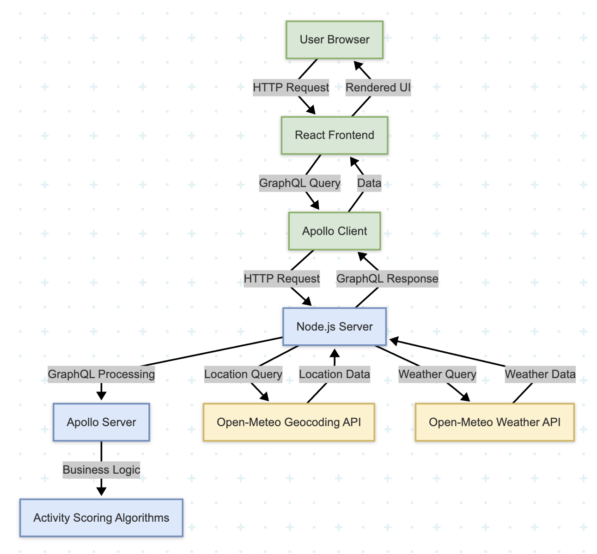

# Weather Activity Forecast

A web application that helps users plan their activities based on weather forecasts. This application analyzes weather data for a given location and provides rankings for various activities (skiing, surfing, outdoor sightseeing, indoor sightseeing) over the next 7 days.

## 📋 Application Overview

The Weather Activity Forecast is designed to help users make informed decisions about when to schedule different types of activities based on weather conditions. By entering a city or town name, users receive personalised recommendations that consider multiple weather factors to determine the optimal days for each activity.

## 🏗️ Architecture Overview

This application follows a clean, modular architecture with a clear separation between frontend and backend:



### Frontend Architecture

- **Technology Stack**: React.js for the UI layer
- **State Management**: Apollo Client for GraphQL state management
- **UI Components**: Modular component structure (App, SearchForm, ActivityList, WeatherCard)
- **Styling**: CSS with responsive design principles

### Backend Architecture

- **Technology Stack**: Node.js with Express
- **API Layer**: GraphQL (Apollo Server) for flexible data querying
- **External Services**: Open-Meteo API for weather data
- **Business Logic**: Scoring algorithms to rank activities based on weather conditions

### Data Flow

1. User enters a location in the UI
2. Frontend sends a GraphQL query to the backend
3. Backend geocodes the location using Open-Meteo's geocoding API
4. Backend fetches weather forecast data from Open-Meteo
5. Backend processes weather data through scoring algorithms for each activity
6. Results are returned to the frontend via GraphQL
7. Frontend displays the ranked activities in a user-friendly interface

## 🛠️ Key Technical Decisions

### GraphQL Over REST

We chose GraphQL for our API layer instead of REST for several reasons:

- **Flexibility**: Allows the frontend to request exactly the data it needs
- **Single Request**: Reduces the number of HTTP requests required
- **Strong Typing**: Provides built-in schema validation and documentation
- **Future-Proofing**: Easier to evolve the API without breaking existing clients

### Scoring Algorithm Design

The app scores each day based on how suitable it is for specific activities.

Each activity uses a custom algorithm that weighs weather conditions differently:

- **Skiing**: Considers snowfall, snow depth, temperature, and wind conditions
- **Surfing**: Analyzes wind speed, temperature, and precipitation
- **Outdoor Sightseeing**: Evaluates weather code (cloudiness), precipitation, temperature, and wind
- **Indoor Sightseeing**: Scores higher on days with unfavorable outdoor weather conditions

Each algorithm produces both a numerical score (0-10) and a human-readable recommendation.

### Responsive UI Design

The application interface was designed to be fully responsive, working well on devices from mobile phones to desktop computers. This was achieved through:

- Flexible grid layout using CSS Grid
- Media queries for different screen sizes
- Relative units for spacing and typography

## 🤖 AI Assistance and Human Judgment

### How AI Tools Assisted Development (chatGPT, DeepSeek & Claude.ai)

AI tools were instrumental in accelerating development:

- **Code Structure**: AI helped generate the initial architecture and file structure
- **Boilerplate Reduction**: Generated common patterns in GraphQL schemas and React components
- **Scoring Algorithms**: Provided mathematical frameworks for activity scoring based on weather parameters

### Where Human Judgment Was Critical

Human expertise was essential in several areas:

- **Algorithm Refinement**: Fine-tuning the scoring systems to match real-world expectations
- **Architecture Decisions**: Determining the best pattern for separation of concerns
- **UX Decisions**: Designing an interface that prioritizes clarity and usability
- **Performance Considerations**: Ensuring efficient data flow between components

## ⚠️ Omissions & Trade-offs

### Features Not Implemented

Due to the time constraints, the following features were intentionally omitted:

1. **User Authentication**: No user accounts or saved preferences
2. **Historical Data**: Only forecast data is used, not historical averages
3. **Activity Customization**: Fixed set of activities rather than user-defined
4. **Detailed Weather Information**: Limited to essential weather parameters
5. **Location Autocomplete**: Basic city input without geocoding service
6. **Multiple Location Comparison**: Only single location search is supported

### Technical Shortcuts

Several technical shortcuts were taken to meet the timeframe:

1. **Error Handling**: Basic error handling implemented, but not comprehensive
2. **Testing**: Manual testing only, no automated tests
3. **Caching**: No client-side or server-side caching implemented
4. **Performance Optimisation**: No code splitting or lazy loading
5. **Detailed UI Polish**: Minimal styling focused on functionality
6. **Accessibility**: Basic accessibility considerations, but not fully optimised

### Production Improvements

In a production environment, we would enhance:

1. **Caching Strategy**: Implement Redis for server-side caching and Apollo Client caching
2. **Testing Suite**: Add Jest for unit tests and Cypress for E2E testing
3. **CI/CD Pipeline**: Set up automated testing and deployment
4. **Error Monitoring**: Implement Sentry/Datadog or similar error tracking
5. **Enhance Scoring**: with machine learning based on user feedback
6. **Implement Rate Limiting**: for the API
7. **Advanced Features**: Add user preferences, location history, and custom activities

## 🚀 Getting Started

### Prerequisites

- Node.js (v14 or higher)
- npm or yarn

### Installation

1. Clone the repository

   ```bash
   git clone https://github.com/Kamacho68/velastra.git
   cd velastra
   ```

2. Install backend dependencies

   ```bash
   cd server
   npm install
   ```

3. Install frontend dependencies
   ```bash
   cd ../client
   npm install
   ```

### Running the Application

1. Start the backend server

   ```bash
   cd server
   npm start
   ```

2. In a new terminal, start the frontend development server

   ```bash
   cd client
   npm start
   ```

3. Open your browser and navigate to `http://localhost:3000`

## 🔮 Conclusion

The Weather Activity Forecast demonstrates a clean, scalable architecture using modern web technologies. While the current implementation is simplified to meet the time constraints, the foundation is solid and would support future enhancements and scaling with minimal refactoring.

The separation of concerns between frontend and backend, use of GraphQL for data fetching, and modular component design all contribute to a maintainable codebase that could easily evolve to support additional features and user requirements.
